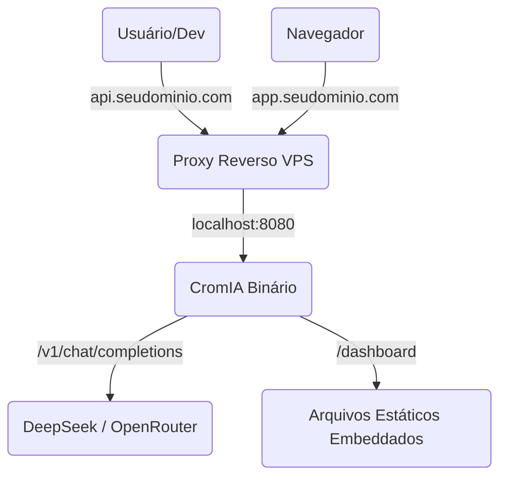

# CromIA API Gateway - Arquitetura

Este documento descreve a arquitetura geral do projeto, projetado para ser um binário Go único, leve e altamente performático.

## 1. Visão Geral
A CromIA deixa de ser um executor de modelos Python (GoPy/llama.cpp) e passa a ser um **Agregador e Proxy de IA**, recebendo requisições compatíveis com OpenAI e roteando-as para provedores como **DeepSeek** e **OpenRouter**.

O grande diferencial do projeto é sua capacidade de **billing (faturamento) em tempo real** e administração facilitada via CLI.

## 2. Componentes do Sistema

A aplicação é dividida logicamente nos seguintes blocos:

1. **Camada HTTP (Router & Handlers)**
   Recebe as requisições na porta especificada. Utiliza middlewares para Autenticação e Checagem de Saldo.
2. **Proxy Engine (Streaming)**
   Faz um _transparent passthrough_ para o DeepSeek ou OpenRouter. Não acumula o stream na memória, copiando os bytes em tempo real (`io.Copy`) de volta ao cliente.
3. **Billing System (Assíncrono)**
   Ao finalizar o stream, o último chunk enviado pelas APIs originais contém o parâmetro `usage`. Uma Goroutine é disparada para computar o custo e descontar da tabela `users`.
4. **Command Line Interface (CLI)**
   Usada exclusivamente no terminal do VPS. Responsável por inicializar o servidor e administrar o banco (criar usuários, creditar saldo, habilitar modelos).
5. **Web Dashboard (Go Embed)**
   As páginas HTML, estilizadas com Tailwind CSS, são embutidas dentro do executável compilado do Go usando a diretiva `go:embed`.

## 3. Roteamento e Subdomínios no VPS

O binário expõe tanto a API de Inteligência Artificial quanto o site frontend simultaneamente.

**Portas Flexíveis:**
Por padrão, `cromia serve` inicializa tudo em uma porta só. Mas comandos como `cromia serve --api-port 8080 --web-port 8081` permitem separar as rotas fisicamente, caso necessário para regras estritas de firewall.
